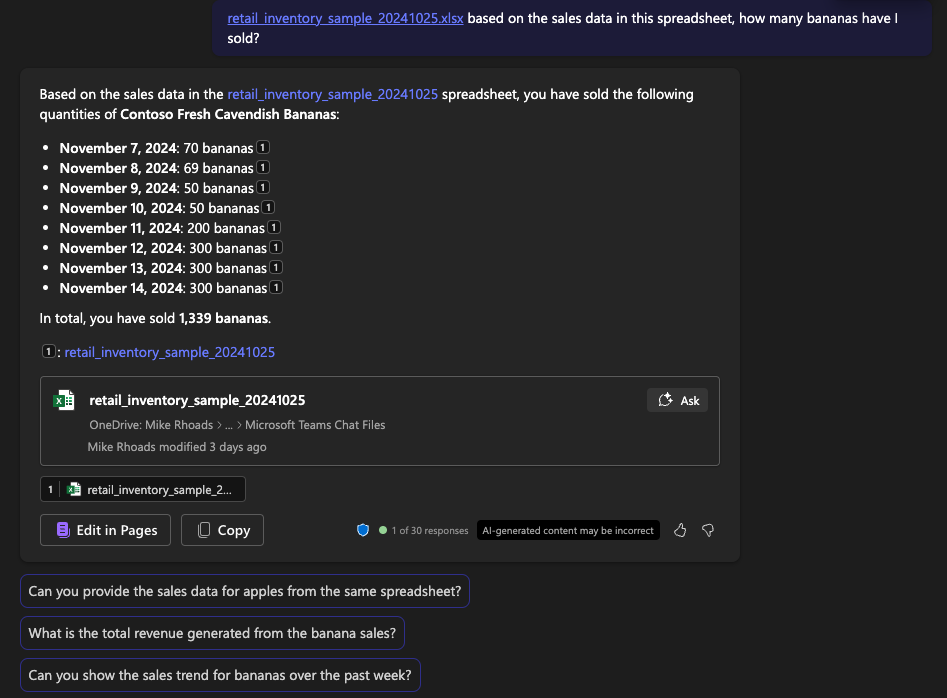

# Predictive Analytics

# Contoso Hypermarket Overview

Contoso Hypermarket uses Copilot M365 to analyze vast amounts of data and generate actionable insights. By integrating Copilot into their existing systems, Contoso can predict trends, optimize inventory, and improve customer satisfaction.  Copilot acts as another employee managers and staff can interact with.

# Working with Spreadsheets

Despite the advancements in technology, spreadsheets remain a crucial tool for many businesses, including Contoso Hypermarket. Copilot M365 seamlessly integrates with older formats like spreadsheets, allowing Contoso to:

- Import and Analyze Data: Copilot can import data from spreadsheets, analyze it, and provide insights without the need for manual data entry.
- Generate Reports: Automatically generate comprehensive reports based on the data in spreadsheets, saving time and reducing errors.
- Predictive Modeling: Use historical data from spreadsheets to build predictive models that forecast future trends and demands.

## Key Benefits

Using Copilot in this way offers several benefits including:

- Efficiency: Automates data analysis and report generation, freeing up valuable time for employees.
- Accuracy: Reduces the risk of human error in data analysis and reporting.
- Scalability: Handles large datasets and complex calculations with ease.

## Prerequisites

This module requires access to M365 Copilot.  For information on enabling this within your organization, please refer to [this](https://learn.microsoft.com/en-us/copilot/microsoft-365/microsoft-365-copilot-enable-users) document.

## Getting Started

> **Note:** AI-generated content may be incorrect.  In addition, the screenshots and Copilot responses may differ.

To begin, download the three spreadsheets:
- [retail_inventory_sample](https://download.microsoft.com/download/0832a0b6-bf27-4a3f-bf65-b3404233f9cb/retail_inventory_sample_20241025.xlsx) - this simulates inventory and sales data for Contoso Hypermarket
- [footfall_sample](https://download.microsoft.com/download/3fe05ab3-2aa7-4c59-8260-d90a92888432/footfall_sample_20241025.xlsx) - this simulates footfall data derived from in-store cameras
- [contoso_roasters](https://download.microsoft.com/download/3fe05ab3-2aa7-4c59-8260-d90a92888432/contoso_roasters_20241025.xlsx) - this is a production log of coffee roasting

## Prompts

The following table provides example prompts and expected results.  Note that the output will likely vary somewhat from this table, but the overall analysis should be similar.  To browse

| Prompt Text | Expected Result | Source Data | Remarks |
|-------------|-----------------|-------------|---------|
| based on the sales data in this spreadsheet, how many bananas have I sold? | we've sold 1,339 bananas | retail_inventory_sample | note that we did not specify the specific product name; just bananas |
| based on the sales data for apples, which locations in the store sell the most apples? | Stock Locations 1, 2, and 3 are the top locations for selling apples, each selling 25 apples per day, while Stock Location 4 sells 15 apples per day | retail_inventory_sample |
| Provide a summary of coffee roasting production. | Overview of coffee roasting production metrics. | contoso_roasters | Check for any missing logs. |
| how many chocolate chip cookies did I sell each day? | a list of cookies sold per day | retail_inventory_sample |
| how many chocolate chip cookies went unsold each day?| a count of the cookies left unsold each day | retail_inventory_sample |
| based on the chocolate chip cookie sales data, which day of the week generates the most cookie sales? | Copilot identifies that most cookies sales are on Friday | retail_inventory_sample |
| which day of the week generates the most unsold chocolate chip cookies? | Copilot identifies that Thursdays have the most unsold cookies | retail_inventory_sample |
| which location in the store produces the least amount of sales? | Copilot identies that Stock Location 4 generates the least amount of sales  | retail_inventory_sample |
| which store location sells the most cookies? | Copilot identifies that Stock Location 2 sells the most cookies | retail_inventory_sample |
| this spreadsheet contains footfall data for each store location. Footfall is the number of people at each store location. Based on this data, which store location has the most footfall? | Copilot indicates that Stock Location 2 has the most footfall | footfall_sample |
| what correlations do you observe between footfall and sales | Copilot observes a correlation between higher footfall traffic with higher sales and that locations with consistent footfall have consistent sales | retail_inventory_sample and footfall_sample | note that it is making correlation between these two spreadsheets without explicitly joining tables | 
| if I can increase footfall to 800, how many chocolate chip cookies should I expect to sell? | Copilot assumes a linear relationship between footfall and sales and estimates we could sell 100 cookies per day with increased footfall | retail_inventory_sample and footfall_sample | while not intended to replace the role of a data scientist, Copilot is able to suggest an estimate based on the relationship between the data in both spreadsheets | 
| using the roast_start_time and cooling_end_time columns, what's the total amount of hours and minutes my Probat roaster has been used so far? | Copilot lists the roast duration for each day and adds of the total roast time | contoso_roasters | this is helpful for tracking periodic maintenance tasks that need to occur |
| which roast profile should I use for City Plus roasts that produces the least amount of moisture loss? | Copilot identifies roast profile_cp_01 as the roast that produces the least amount of moisture loss| contoso_roasters | everything else equal, it's desirable to use the roast profile that produces the least amount of moisture loss because it means there's more salable product for an equally good product |
| how much energy have I used for all of my roasts this month? | Copilot adds the data in the for power consumption| contoso_roasters | note that Copilot is able to identify the pertinent field from the spreadsheet to answer this question | 
| how many kilograms of Tanzanian beans have I roasted? | Copilot lists the two days where this bean type was roasted and lists the total amount roasted | contoso_roasters |
| how many kilograms of beans from Mexico have I roasted this month? | Copilot identifies the two varieties of Mexican beans roaster and lists the total amount roasted | contoso_roasters | note that Copilot does not need to be explicitly told about the Mexican bean varieties |
| which coffee stays on the store shelves the longest? | Copilot identifies that the Tanzanian beans is unsold and stays on the shelves the longest | contoso_roasters |
| if current sales trends of coffee continues, how much Mexican beans should I order for roasting? | Copilot estimates average daily sales, projects it over a month, and suggests a quantity of Mexican beans to order | contoso_roasters and retail_inventory_sample |
| how much beans from Tanzania should I order if I except a 10% increase in demand for these beans over the next month? | Copilot looks at the two different roasts of Tanzanian beans and estimates the demand for each based on a 10% increase in demand | contoso_roasters and retail_inventory_sample |
